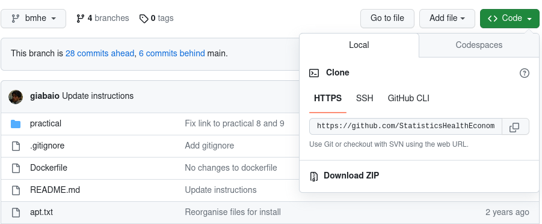

# Summer School "Bayesian methods in health economics" 
## Rstudio environment

This repository contains the set up to create a Rstudio environment with all the relevant packages and programmes installed.

This is useful to work on the practicals. You may want to also install the full BMHE configuration on your local machine, but this is useful if you are in a hurry and want to do work (or you don't have full write access to your machine).

## Local installation

Alternatively, you can use this repository onto your computer and use it locally. There are various ways in which you can do so.

### Download the content to your computer

If you are not familiar with GitHub, your best option is probably to simply download the content of this repository. 

- Click on green button labelled as `<> Code` in the top-right corner and then click on `Download zip`, as shown in the picture below.

Once the download is complete, unzip the folder.

